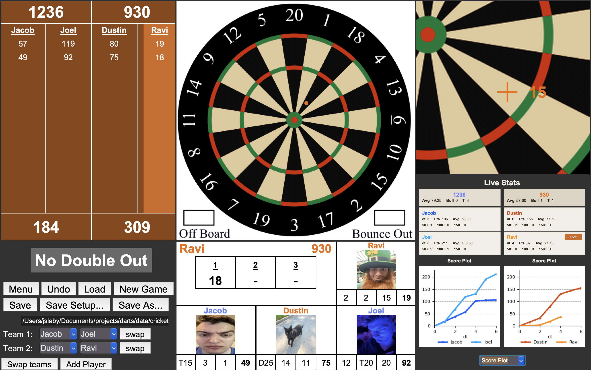
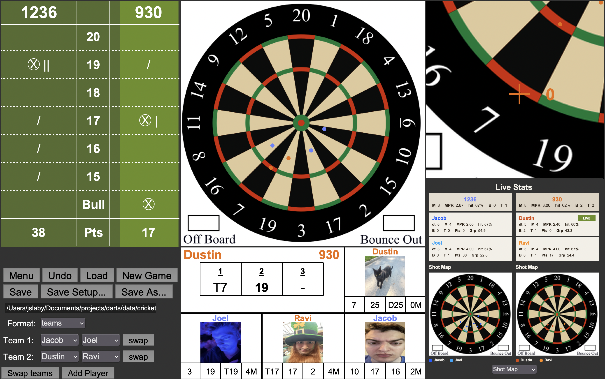

# OpenDart

OpenDart is a darts scoreboard app with three playable modes:

- `501`
- `Cricket`
- `Cricket 1v1`

Primary use case is 2v2 teams games.

## UI Examples

### 501



### Cricket



## Features

- Fullscreen dartboard click UI
- `501`, `Cricket`, and `Cricket 1v1` game modes
- Launcher menu for choosing and switching games
- Save/load game histories as JSON
- Win detection with a popup and optional save prompt
- Turn history / infoboard summaries
- Live stats panels with:
  - player and team stats
  - shot maps
  - scoring plots
- Player image support from `profile_pics/`

## Project Layout

### Main entrypoints

- [darts.py](darts.py)
  Launcher menu. This is the recommended way to start the app.
- [501.py](501.py)
  Standalone 501 UI app and reusable `DartsApp` class.
- [cricket.py](cricket.py)
  Standalone cricket UI app and reusable `DartsApp` class for both team and solo cricket.

### Game engines

- [dart_engine/params_501.py](dart_engine/params_501.py)
  501 game state and scoring rules.
- [dart_engine/params_cricket.py](dart_engine/params_cricket.py)
  Team cricket game state and scoring rules.
- [dart_engine/params_cricket_1x1.py](dart_engine/params_cricket_1x1.py)
  Solo cricket game state and scoring rules.

### Shared UI / utility modules

- [dart_engine/ui_common.py](dart_engine/ui_common.py)
  Shared config, save/load dialogs, history replay, and JSON helpers.
- [dart_engine/player_ui.py](dart_engine/player_ui.py)
  Shared hit formatting, player image lookup, and turn-summary helpers.
- [dart_engine/helpers_general.py](dart_engine/helpers_general.py)
  Dartboard click interpretation and a few shared helpers.
- [dart_engine/helpers_501.py](dart_engine/helpers_501.py)
  501 checkout and score-history helpers.
- [dart_engine/cricket_stats.py](dart_engine/cricket_stats.py)
  Cricket mark-history aggregation helpers.

### Assets / data

- [dartboard_images/dartboard_accurate.png](dartboard_images/dartboard_accurate.png)
  Main dartboard image.
- [references/dart_out_chart.csv](references/dart_out_chart.csv)
  501 checkout recommendations.
- [profile_pics/default.png](profile_pics/default.png)
  Fallback player image.

### Analysis scripts

- [plot_data.py](plot_data.py)
- [process_data.py](process_data.py)

These are not required to run the app, but they are useful for offline analysis and experimentation.

## Running the App

`python darts.py`

This opens the launcher menu, where you can choose:

- `Cricket`
- `501`
- `Cricket 1v1`

### Direct entrypoints

You can also run either game directly:

```bash
python 501.py
python cricket.py
```

## Game Flow

### Launcher

The launcher in [darts.py](darts.py) creates one fullscreen Tk root, then loads the selected game UI into that root. Each game includes a `Menu` button so you can return to the launcher and switch games without restarting Python.

### 501

- Two teams of two players
- Shared team score starts at `501`
- Standard double-out behavior
- Recommender panel shows suggested checkout sequence when available
- Win popup appears when a team finishes on a double

### Cricket

- Team mode: two players per team
- Solo mode: one player per side
- Tracks marks, closures, overflow scoring, and points
- Win popup appears when a side has closed all cricket numbers and is tied or ahead on score

## Save / Load Format

Game histories are stored as JSON with a top-level `dart_history` array.

Each recorded dart includes:

- `player`
- `team`
- `x`
- `y`
- `number`
- `multiplier`

The UI uses this history both for save/load and for rebuilding state through replay.

## UI Overview

Both game screens use the same broad layout:

- left: main scoreboard and control area
- center: main dartboard plus infoboard
- right: zoom board and live stats panel

### Stats panel

The stats panel includes:

- player and team stat cards
- a selector to switch between:
  - `Shot Map`
  - `Score Plot`

The plot views are rendered with matplotlib using the `proj` environment.

## Images and Player Names

Player dropdowns are loaded from `dart_engine/config.json` when available. New players can be added from the UI and are persisted back into config.

Profile images are looked up by searching `profile_pics/` for a filename containing the player name. If no matching image exists, the default image is used.

## Development Notes

### Shared patterns

- State lives in the `params_*` game engine modules.
- UI files are responsible for drawing, save/load, and history-driven summaries.
- Most expensive UI-derived state is cached and rebuilt only when history changes.

### Import behavior

Both [501.py](501.py) and [cricket.py](cricket.py) are safe to import because they only create a Tk root inside `if __name__ == "__main__":`.

### Known limitations

- `swap_players_history()` and `swap_teams_history()` in [dart_engine/helpers_general.py](dart_engine/helpers_general.py) are still placeholders.
- Layout is tuned for fullscreen desktop use rather than small/resizable windows.
- The launcher currently reuses a single root window and destroys/rebuilds widgets when switching games.

## Quick Reference

### Start launcher

```bash
python darts.py
```

## Additional Documentation

For a short codebase/architecture map, see [docs/architecture.md](docs/architecture.md).
